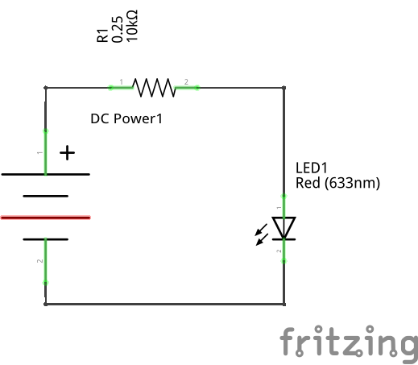
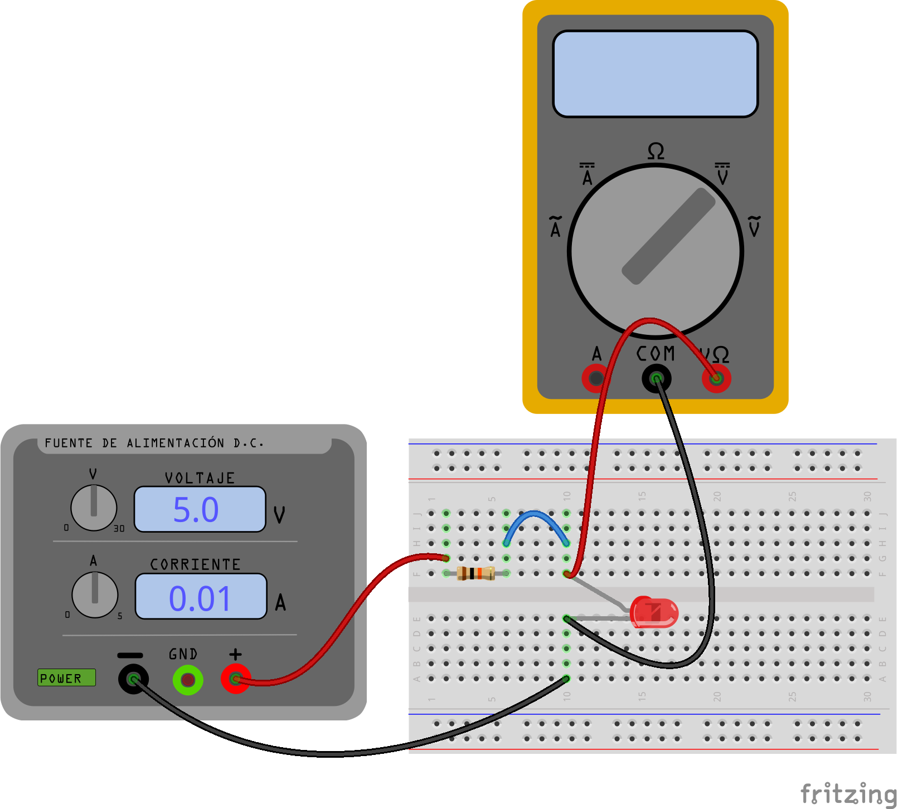

```{=html}
<!--
author:   Johnny Cubides
email:    jgcubidesc@unal.edu.co
version:  0.1.0
language: en
narrator: UK English Female
logo:     
comment:  Documentación para el curso de Taller de Ingeniería Electrónica de la Universidad Nacional de Colombia
script:   https://cdn.jsdelivr.net/chartist.js/latest/chartist.min.js
          https://felixhao28.github.io/JSCPP/dist/JSCPP.es5.min.js
link:     https://cdn.jsdelivr.net/chartist.js/latest/chartist.min.css
link:     https://cdnjs.cloudflare.com/ajax/libs/animate.css/4.1.1/animate.min.css
-->
```
# Taller de Ingeniería Electrónica

[Enlace liascript del curso](https://liascript.github.io/course/?https://raw.githubusercontent.com/johnnycubides/taller-ing-electronical-UNAL/main/README.md#1)

## Proceso de diseño

### Ideación

[Vídeo actividad 1](https://drive.google.com/file/d/1cr9HWrEm-xNYFIIi8ZitDjLSpGTT1DDn/view?usp=share_link)

### Diagrama de Cajas Negras


<div>

    <iframe width="560" height="315" src="https://www.youtube.com/embed/HvkKBwPVH_0" title="YouTube video player" frameborder="0" allow="accelerometer; autoplay; clipboard-write; encrypted-media; gyroscope; picture-in-picture; web-share" allowfullscreen>
    </iframe>

</div>

### Diagrama de flujo

### Poster

## Herramientas

### Tarjetas de desarrollo

-   [Raspberry Pi Pico](https://www.raspberrypi.com/products/raspberry-pi-pico/)
-   [Raspberry Pi Pico W](https://www.raspberrypi.com/products/raspberry-pi-pico/)
-   [NodeMCU esp8266](https://github.com/nodemcu/nodemcu-devkit)
-   [NodeMCU esp32 wroom]()
-   [Esp32CAM]()
-   [BluePill (stm32f103)]()
-   [Arduino UNO (atmega328p)]()
-   [Arduino Nano (atmega328p)]()
-   [Arduino Pro (atmega328p)]()

**Comparativa entre placas de desarrollo**

| Tarjeta de Desarrollo | Arquitectura | Lenguaje de prog | Perifericos | RAM @ ROM | N. pines io | Vin @ Vpin |

|---|---|---|---|---|---|---|
| NodeMCU esp32 Wroom | espressif xtensa, dos nucleos, 80 to 240 MHz, 32bits | Python, Lua, C, C++, Forth, Asm | uart, i2s, spi, adc, dac, wifi, bluetooth | 520 KB sram @ 448 KB rom y 4 MB flash | 25 Digitales de los cuales 15 Analógicos | 5V @ 3.3V |
| ESP32CAM Wroom | espressif xtensa, dos nucleos, 80 to 240 MHz, 32bits | Python, Lua, C, C++, Forth, Asm | uart, i2s, spi, adc, dac, wifi, bluetooth, camera | 520 KB sram y psram 4MB @ 448 KB rom y 4 MB flash | 10 Digitales de los cuales 7 Analógicos | 5V @ 3.3V |
| Nodemcu esp8266 e12 | espressif xtensa, 80MHz to 160 MHz, 32bits | Python, Lua, C, C++, Forth, Asm | uart, i2s, spi, adc, dac, wifi | 50 KB @ 4 MB flash | 10 Digitales y 1 ADC | 5V @ 3.3V |
| Raspberry Pi Pico | rp2040, dos nucleos, 133 MHz, 32bits | Python, Lua, C, C++, Forth, Asm | uart, i2s, spi, adc, dac | 264 KB sram @ 2MB flash | 23 Digitales y 3 Analógicos | 5V @ 3.3V |
| Raspberry Pi Pico W | rp2040, dos nucleos, 133 MHz, 32bits | Python, Lua, C, C++, Forth, Asm | uart, i2s, spi, adc, dac, wifi, bluetooth | 264 KB sram @ 2MB flash | 23 Digitales y 3 Analógicos | 5V @ 3.3V |
| Arduino UNO | Atmega328p, 16MHz, avr8, 8bits | C, C++, Forth, Asm | uart, i2s, spi, adc | 2 KB sram @ 32 KB flash | 20 Digitales y de ellos 6 Analógicos | 5V @ 5V o 3.3V |
| Arduino Nano | Atmega328p, 16MHz, avr8, 8bits | C, C++, Forth, Asm | uart, i2s, spi, adc | 2 KB sram @ 32 KB flash | 20 Digitales y de ellos 6 Analógicos | 5V @ 5V o 3.3V |
| Arduino Pro | Atmega328p, 16MHz, avr8, 8bits | C, C++, Forth, Asm | uart, i2s, spi, adc | 2 KB sram @ 32 KB flash | 20 Digitales y de ellos 6 Analógicos | 5V @ 5V o 3.3V |

|Hola|Como vas|que tal todo|
|:-------------:|:-------------:|:-----:|
|h|h|h|

#### Nodemcu ESP32 Wroom

**Esp32 dev kit**:


**Pinout esp32**:


**Herramientas para esp32:**

-   [Configuración de Thonny editor para micropython en placas de desarrollo esp8266 y esp32](https://randomnerdtutorials.com/getting-started-thonny-micropython-python-ide-esp32-esp8266/)

-   [Firmware micropython para esp32 (Download firmware.bin)](https://micropython.org/download/esp32/)

-   [Referencia rápida de micropython con el esp32](https://docs.micropython.org/en/latest/esp32/quickref.html)

#### ESP32CAM

**Esp32CAM:**


**¿Cómo conectar el esp32CAM?:**

El esp32CAM no cuenta con un adaptador USB a UART en la placa y este debe ser agregado, existen varios que pueden ser útiles como pueden ser:

-   FT232RL (recomendado)
-   CH340
-   CP2102

El siguiente gráfico muestra cómo debe quedar conectado el esp32CAM, el cable de color verde es agregado en el momento de subir el firmware y no es requerido cuando
el esp32cam está en modo de ejecución de programas.


**Pinout del esp32cam:**


**Herramientas de referecia**:

-   [Todo sobre el esp32cam](https://randomnerdtutorials.com/esp32-cam-video-streaming-face-recognition-arduino-ide/)
-   [Esp32cam con micropython](https://github.com/tsaarni/esp32-micropython-webcam)
-   [Esp32cam con micropython](https://github.com/lemariva/micropython-camera-driver)

#### Raspberry Pi Pico y Pico W

**Raspberry Pi Pico y Pico W:**


**Pinout raspberry pi pico:**


**Herramientas y documentación Raspberry pi pico:**

-   [Firware micropython: descarga e instalación](https://www.raspberrypi.com/documentation/microcontrollers/micropython.html#drag-and-drop-micropython)

-   [Documentación de micropython para raspberry pi pico](https://docs.micropython.org/en/latest/rp2/quickref.html)

-   [Hoja de datos (datasheet) para la raspberry pi pico](https://datasheets.raspberrypi.com/pico/pico-datasheet.pdf)

#### Arduino UNO

**Arduino UNO:**


**Pinout de Arduino UNO:**


**Herramientas para Arduino:**

-   [Arduino IDE (software)](https://www.arduino.cc/en/software)

### Entornos de programación

-   [Thonny Editor](https://thonny.org/)
-   [MIT App Inventors](https://appinventor.mit.edu/)
-   [Arduino IDE](https://www.arduino.cc/en/software)
-   [Espruino](https://www.espruino.com/)
-   [Node-RED](https://nodered.org/)

#### Thonny Editor


Tohnny Editor es un entorno de desarrollo en lenguanje [Python](https://docs.python.org/es/3/tutorial/) que puede servir para diferentes
placas de desarrollo con un intérprete de [Micropython](https://micropython.org/):

-   esp8266
-   esp32
-   Raspberry Pi Pico

En el siguiente enlace encontrá las instrucciones de instalación según sistema operativo y placa de
desarrollo:

[Cómo instalar Thonny Editor y configurar para una placa de desarrollo](https://randomnerdtutorials.com/getting-started-thonny-micropython-python-ide-esp32-esp8266/)

### Simuladores de circuitos

-   Qucs
-   LTSpice
-   CircuitJS

#### Qucs


**Instalación de Qucs en Windows y primer acercamiento**

<div>

    <iframe width="560" height="315" src="https://www.youtube.com/embed/624if7zhbIU" title="YouTube video player" frameborder="0" allow="accelerometer; autoplay; clipboard-write; encrypted-media; gyroscope; picture-in-picture; web-share" allowfullscreen>
    </iframe>

</div>

**Ejemplos de uso de Qucs en GitHub**

En el siguiente repositorio de github podrá encontrar Ejemplos
de uso para dominar este excelente simulador.


[Ejemplos de uso de Qucs en github](https://github.com/johnnycubides/qucs-tutorial-examples/tree/main/examples)

### Herramientas para diagramar

-   [Excalidraw](https://excalidraw.com/)
-   [Drawio](https://github.com/jgraph/drawio-desktop/releases)
-   [Pencil Project](https://pencil.evolus.vn/)

### Herramientas de documentación

-   GitHub
-   Codeberg
-   Bitbucket
-   Gitlab

Las anteriores herramientas hacen uso del formato de Markdown para realizar la documentación **Markdown**.

#### Markdown


[Tutorial Markdown](https://www.markdowntutorial.com/es/)

## Talleres

### Iniciandome con las herramientas de desarrollo

Este taller pretende orientar al estudiante en el inicio *Maker*; en
este taller se enfretará a desarrollar cosas como:

-   Análisis de corriente de un circuito D.C.

#### Mi primer circuito

Puedes decargar el taller "Mi primer circuito" desde [aquí](./docs/taller1.md.pdf)




**Medir voltaje en los componentes con el mutímetro**:




## Tiendas electrónicas

A continuación se comparte una lista de tiendas electrónicas que se
encuentran en bogotá y sus alrededores.

https://www.sigmaelectronica.net/

https://www.mactronica.com.co/

https://yorobotics.co/

https://electronilab.co/

https://www.vistronica.com/

https://www.controldinamico.com/

https://ferretronica.com/

https://laredelectronica.com/

https://www.bigtronica.com/

https://www.embtronik.com/

https://www.tuvoltio.com/

https://osakaelectronicsltda.com/

http://www.microelectronicos.com/

https://tundamacomplejoelectronico.com/locales/

https://ja-bots.com/
