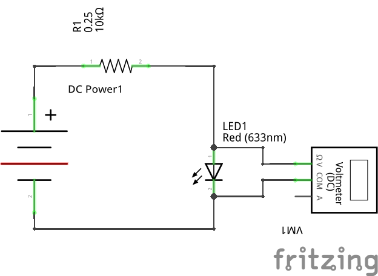

```{=html}
<!--
author:   Johnny Cubides
email:    jgcubidesc@unal.edu.co
version:  0.1.0
language: en
narrator: UK English Female
logo:     
comment:  Documentación para el curso de Taller de Ingeniería Electrónica de la Universidad Nacional de Colombia
script:   https://cdn.jsdelivr.net/chartist.js/latest/chartist.min.js
          https://felixhao28.github.io/JSCPP/dist/JSCPP.es5.min.js
link:     https://cdn.jsdelivr.net/chartist.js/latest/chartist.min.css
link:     https://cdnjs.cloudflare.com/ajax/libs/animate.css/4.1.1/animate.min.css
-->
```
# Taller de Ingeniería Electrónica

[Enlace liascript del curso](https://liascript.github.io/course/?https://raw.githubusercontent.com/johnnycubides/taller-ing-electronical-UNAL/main/README.md#1)

## Proceso de diseño


### Ideación

[Vídeo actividad 1](https://drive.google.com/file/d/1cr9HWrEm-xNYFIIi8ZitDjLSpGTT1DDn/view?usp=share_link)

### Diagrama de Cajas Negras


<div>

    <iframe width="560" height="315" src="https://www.youtube.com/embed/HvkKBwPVH_0" title="YouTube video player" frameborder="0" allow="accelerometer; autoplay; clipboard-write; encrypted-media; gyroscope; picture-in-picture; web-share" allowfullscreen>
    </iframe>

</div>

### Diagrama de flujo

### Poster

## Creación de PCB

### Tamaño de pistas para el ruteo de pistas

Para algunas tecnologías que encontrarán en Bogotá para creación de la PCB
se recomienda en KiCad hacer uso de los siguientes tamaños:


Las anteriores reglas definen dos tipos de clases, una que se llama POWER, para las pistas que
requieren conducir más energía y las SIGNAL, las cuales son solo señales de información. Si
requiere que por las pistas circule una mayor corriente, deberá diseñar pistas con un ancho mayor.

Estas reglas las puede editar en `File -> Board Setup -> Desing Rules -> Net Classes`

A continuación se puede ver un ejemplo donde se asocia las reglas de net a específicos patrones
de nets


### Conectores pinheader y pinsocket

Estos conectores se pueden usar para diferentes sensores y actuadores, como es el caso
de sensores ultrasonido o servomotores sg90. En kicad las huellas son conocidas
como pinheader de 2.54mm y pinsocket de 2.54mm


## Herramientas

### Tarjetas de desarrollo

-   [Raspberry Pi Pico](https://www.raspberrypi.com/products/raspberry-pi-pico/)
-   [Raspberry Pi Pico W](https://www.raspberrypi.com/products/raspberry-pi-pico/)
-   [NodeMCU esp8266](https://github.com/nodemcu/nodemcu-devkit)
-   [NodeMCU esp32 wroom]()
-   [Esp32CAM]()
-   [BluePill (stm32f103)]()
-   [Arduino UNO (atmega328p)]()
-   [Arduino Nano (atmega328p)]()
-   [Arduino Pro (atmega328p)]()

**Comparativa entre placas de desarrollo**

|Tarjeta de Desarrollo|Arquitectura|Lenguaje de prog|Perifericos|RAM @ ROM|N. pines io|Vin @ Vpin|
|:-------------------:|:----------:|:--------------:|:---------:|:-------:|:---------:|:--------:|
| NodeMCU esp32 Wroom | espressif xtensa, dos nucleos, 80 to 240 MHz, 32bits | Python, Lua, C, C++, Forth, Asm | uart, i2s, spi, adc, dac, wifi, bluetooth | 520 KB sram @ 448 KB rom y 4 MB flash | 25 Digitales de los cuales 15 Analógicos | 5V @ 3.3V |
| ESP32CAM Wroom | espressif xtensa, dos nucleos, 80 to 240 MHz, 32bits | Python, Lua, C, C++, Forth, Asm | uart, i2s, spi, adc, dac, wifi, bluetooth, camera | 520 KB sram y psram 4MB @ 448 KB rom y 4 MB flash | 10 Digitales de los cuales 7 Analógicos | 5V @ 3.3V |
| Nodemcu esp8266 e12 | espressif xtensa, 80MHz to 160 MHz, 32bits | Python, Lua, C, C++, Forth, Asm | uart, i2s, spi, adc, dac, wifi | 50 KB @ 4 MB flash | 10 Digitales y 1 ADC | 5V @ 3.3V |
| Raspberry Pi Pico | rp2040, dos nucleos, 133 MHz, 32bits | Python, Lua, C, C++, Forth, Asm | uart, i2s, spi, adc, dac | 264 KB sram @ 2MB flash | 23 Digitales y 3 Analógicos | 5V @ 3.3V |
| Raspberry Pi Pico W | rp2040, dos nucleos, 133 MHz, 32bits | Python, Lua, C, C++, Forth, Asm | uart, i2s, spi, adc, dac, wifi, bluetooth | 264 KB sram @ 2MB flash | 23 Digitales y 3 Analógicos | 5V @ 3.3V |
| Arduino UNO | Atmega328p, 16MHz, avr8, 8bits | C, C++, Forth, Asm | uart, i2s, spi, adc | 2 KB sram @ 32 KB flash | 20 Digitales y de ellos 6 Analógicos | 5V @ 5V o 3.3V |
| Arduino Nano | Atmega328p, 16MHz, avr8, 8bits | C, C++, Forth, Asm | uart, i2s, spi, adc | 2 KB sram @ 32 KB flash | 20 Digitales y de ellos 6 Analógicos | 5V @ 5V o 3.3V |
| Arduino Pro | Atmega328p, 16MHz, avr8, 8bits | C, C++, Forth, Asm | uart, i2s, spi, adc | 2 KB sram @ 32 KB flash | 20 Digitales y de ellos 6 Analógicos | 5V @ 5V o 3.3V |

#### Nodemcu ESP32 Wroom

**Esp32 dev kit**:


**Pinout esp32**:


**Herramientas para esp32:**

-   [Configuración de Thonny editor para micropython en placas de desarrollo esp8266 y esp32](https://randomnerdtutorials.com/getting-started-thonny-micropython-python-ide-esp32-esp8266/)

-   [Firmware micropython para esp32 (Download firmware.bin)](https://micropython.org/download/esp32/)

-   [Referencia rápida de micropython con el esp32](https://docs.micropython.org/en/latest/esp32/quickref.html)

#### ESP32CAM

**Esp32CAM:**


**¿Cómo conectar el esp32CAM?:**

El esp32CAM no cuenta con un adaptador USB a UART en la placa y este debe ser agregado, existen varios que pueden ser útiles como pueden ser:

-   FT232RL (recomendado)
-   CH340
-   CP2102

El siguiente gráfico muestra cómo debe quedar conectado el esp32CAM, el cable de color verde es agregado en el momento de subir el firmware y no es requerido cuando
el esp32cam está en modo de ejecución de programas.


**Pinout del esp32cam:**


**Herramientas de referecia**:

-   [Todo sobre el esp32cam](https://randomnerdtutorials.com/esp32-cam-video-streaming-face-recognition-arduino-ide/)
-   [Esp32cam con micropython](https://github.com/tsaarni/esp32-micropython-webcam)
-   [Esp32cam con micropython](https://github.com/lemariva/micropython-camera-driver)

#### Raspberry Pi Pico y Pico W

**Raspberry Pi Pico y Pico W:**


**Pinout raspberry pi pico:**


**Herramientas y documentación Raspberry pi pico:**

-   [Firware micropython: descarga e instalación](https://www.raspberrypi.com/documentation/microcontrollers/micropython.html#drag-and-drop-micropython)

-   [Documentación de micropython para raspberry pi pico](https://docs.micropython.org/en/latest/rp2/quickref.html)

-   [Hoja de datos (datasheet) para la raspberry pi pico](https://datasheets.raspberrypi.com/pico/pico-datasheet.pdf)

#### Arduino UNO

**Arduino UNO:**


**Pinout de Arduino UNO:**


**Herramientas para Arduino:**

-   [Arduino IDE (software)](https://www.arduino.cc/en/software)

### Entornos de programación

-   [Thonny Editor](https://thonny.org/)
-   [MIT App Inventors](https://appinventor.mit.edu/)
-   [Arduino IDE](https://www.arduino.cc/en/software)
-   [Espruino](https://www.espruino.com/)
-   [Node-RED](https://nodered.org/)

#### Thonny Editor


Tohnny Editor es un entorno de desarrollo en lenguanje [Python](https://docs.python.org/es/3/tutorial/) que puede servir para diferentes
placas de desarrollo con un intérprete de [Micropython](https://micropython.org/):

-   esp8266
-   esp32
-   Raspberry Pi Pico

En el siguiente enlace encontrá las instrucciones de instalación según sistema operativo y placa de
desarrollo:

[Cómo instalar Thonny Editor y configurar para una placa de desarrollo](https://randomnerdtutorials.com/getting-started-thonny-micropython-python-ide-esp32-esp8266/)

### Simuladores de circuitos

-   Qucs
-   LTSpice
-   CircuitJS

#### Qucs


**Instalación de Qucs en Windows y primer acercamiento**

<div>

    <iframe width="560" height="315" src="https://www.youtube.com/embed/624if7zhbIU" title="YouTube video player" frameborder="0" allow="accelerometer; autoplay; clipboard-write; encrypted-media; gyroscope; picture-in-picture; web-share" allowfullscreen>
    </iframe>

</div>

**Ejemplos de uso de Qucs en GitHub**

En el siguiente repositorio de github podrá encontrar Ejemplos
de uso para dominar este excelente simulador.


[Ejemplos de uso de Qucs en github](https://github.com/johnnycubides/qucs-tutorial-examples/tree/main/examples)

### Herramientas para diagramar

-   [Excalidraw](https://excalidraw.com/)
-   [Drawio](https://github.com/jgraph/drawio-desktop/releases)
-   [Pencil Project](https://pencil.evolus.vn/)

### Herramientas de documentación

-   GitHub
-   Codeberg
-   Bitbucket
-   Gitlab

Las anteriores herramientas hacen uso del formato de Markdown para realizar la documentación **Markdown**.

#### Markdown


[Tutorial Markdown](https://www.markdowntutorial.com/es/)

## Talleres

```{=html}
<!-- !include`incrementSection=2,raw="markdown"` ./taller1.md -->
```
```{=html}
<!-- !include`format="markdown"` ./taller1.md -->
```
```{=html}
<!-- !include`incrementSection=2,format="markdown"` ./taller1.md -->
```
### Iniciandome con las herramientas de desarrollo

Este taller pretende orientar al estudiante en el inicio *Maker*; en
este taller se enfretará a desarrollar cosas como:

-   Análisis de corriente de un circuito D.C.

#### Uso del multímetro

-   ¿Cómo verificar que los fusibles del multímetro no están dañados?
-   ¿Cómo medir el valor de una resistencia?
-   ¿Cómo calcular el valor de una resistencia de carbón?
-   Configuración de fuente DC y medición de tensión de la misma con el multímetro

**Referencias útiles**

-   [Calculadora de resistencias digikey](https://www.digikey.com/es/resources/conversion-calculators/conversion-calculator-resistor-color-code)
-   Ver el vídeo [Resistencias explicadas](https://www.youtube.com/watch?v=blUimcoNpKs&t)

#### Mi primer circuito

Puedes decargar el taller "Mi primer circuito" desde [aquí](./docs/taller1.md.pdf)

1.  MATERIALES A USAR

-   Una fuente de energía D.C. de tensión variable.
-   Un par de cables bananas caimán
-   Conectores rápidos (jumper dupon)
-   Protoboard
-   Una resistencia de cualquier valor no mayor a 33 Kohms.
-   Un LED de cualquier color.
-   Dos multímetros, uno para medir corriente y el otro tensión.
-   Cuaderno para realizar apuntes

2.  REALIZA ESTE PRIMER MONTAJE

A continuación podrás ver un diagrama pictográfico el cual es una aproximación
de como se ven las cosas realmente.


Una manera abstracta de entender como está interconectado un circuito es a través
de un esquemático, este diagrama muestra los componentes representados por símbolos
con sus nodos de conexión y además etiquetados como sigue:

> R1: Resistencia
> DC Power 1: Fuente de energía DC
> LED1: Diodo emisor de Luz


3.  ENERGIZAR CIRCUITO

-   Se debe verificar que el circuito realizado corresponda al propuesto en esta guía.
-   A continuación conecta la fuente de energía y empieza con un voltaje de 0 V.
-   Realizar incrementos de tensión de la fuente hasta que el LED se encienda y que la intensidad lumínica sea la deseada,
    es decir, ni tan tenue pero tampoco tan intensa.

**Observación**: En la electrónica existen componentes polarizados y no polarizados, un elemento no polarizado
es aquel que no requiere una orientación para su funcionamiento como sucede con la resistencia; en el caso
del LED este si tiene polaridad (Ánodo y Cátodo) y si no enciende es muy probable que deba intercambiar
sus pines de conexión para su funcionamiento correcto.

4.  MEDIR VOLTAJE EN CADA COMPONENTE DEL CIRCUITO

Como se mencionó con anterioridad, tenemos tres componentes R1, DC Power y LED1. Para
medir el voltaje deberás poner el multimetro en modo V en DC, como se ilustra en las
siguiente imagen, además de lo anterior, se pone las puntas del multimetro en los puertos
de conexión indicados como **COM** (cable negro) y **V**. Las puntas del multimetro deberán
ser conectada sobre cada componente en cada uno de sus nodos de conexión, en la imagen siguiente
se observa como se realiza la medición de la tensión (voltaje) en el *LED1*.


Observar el diagrama esquemático siguiente, en el se puede observar como se realiza la medición
de la tensión.



Comprendiendo como se realiza las mediciones de tensión en cada uno de los tres componentes,
registra los valores obtenidos en una tabla, como en el siguiente ejemplo:

|Componente|Tension V|
|:--------:|:-------:|
|R1|3.5 V|
|DC Power 1| 5 V|
|LED1|1.5 V|

4.  COMPROBAR LA SIGUIENTE TEORÍA

En un circuito existen componentes activos y pasivos; los activos son aquellos que son
capaces de entregar energía como es el caso de la *DC Power*, mientras que los pasivos
son aquellos que consumen energía como es el caso de *R1* y *LED* los cuales
manifiestan este consumo en Luz y calor.

Un circuito eléctrico cerrado como es el caso anterior donde solo hay un camino cerrado por donde pueda
transportarse electricidad conservará su energía; lo anterior se puede interpretar como sigue:
`la energía que se entrega al circuito es igual a la que se consume`.

Lo anterior en terminos de voltaje se puede representar así:

> $$ V_{DC\_POWER\_1} = V_{R1} + V_{LED1} $$

Hay que comprobar la anterior ecuación, tomando los valores obtenidos y registrados en la tabla comprueba
que la tensión en la fuente es igual a la suma de las tensiones de los componentes que consumen energía.

#### Driver de motor

## Tareas recomendadas

-   Ver el vídeo [Resistencias explicadas](https://www.youtube.com/watch?v=blUimcoNpKs&t), realizar la documentación (resumen, grafo, entre otros), compartir el resumen en discord.
-   Ver el víde [Cómo medir componentes electricos en PCB](https://youtu.be/h32zF39gwwY?si=oVr16mUTg775PU54), realizar la documentación (resumen, grafo, entre otros), compartir el resumen en discord.

## Vídeos recomendados en clase

-   [Simbiosos entre el arte, la ciencia y la tecnologia](https://www.youtube.com/watch?v=AB9VToh2y-s)
-   [Por esto no podemos tener cosas bonitas (obsolescencia)](https://youtu.be/m8KqmgSPAtg?si=kqyl1KUPXwsxRof2)
-   [África: El vertedero electrónico](https://youtu.be/zfDWE0TyS-w?si=99KWKwdTMwPvmHpL)
-   [Tecnología criolla](https://youtu.be/fh5WTvsvSwg?si=UOBS7h-vBRLTMpoZ)
-   [Arduino el documental](https://youtu.be/mltWc9_C9gs?si=kiv2YYFiv9YqnJFI)
-   [Construimos un smartwatch](https://youtu.be/GC0GuNWkyHg?si=jfrezkIOTFkaNdBO)

## Tiendas electrónicas

A continuación se comparte una lista de tiendas electrónicas que se
encuentran en bogotá y sus alrededores.

https://www.sigmaelectronica.net/

https://www.mactronica.com.co/

https://yorobotics.co/

https://electronilab.co/

https://www.vistronica.com/

https://www.controldinamico.com/

https://ferretronica.com/

https://laredelectronica.com/

https://www.bigtronica.com/

https://www.embtronik.com/

https://www.tuvoltio.com/

https://osakaelectronicsltda.com/

http://www.microelectronicos.com/

https://tundamacomplejoelectronico.com/locales/

https://ja-bots.com/

## Proyectos

**Plataformas de Crowdfunding**

Las plataformas de crowdfunding permiten visibilizar e impulsar proyectos
de emprendimiento artísticos, de desarrollo, de innovación entre otros.
Allí se han apoyado ideas de desarrollo interesante como han sido:

[Omega2](https://www.kickstarter.com/projects/onion/omega2-5-iot-computer-with-wi-fi-powered-by-linux?lang=es): Sistema embebido que costaba 5 dólares con capacidad de correr Linux y conexión WiFi.

[Mycropython](https://www.kickstarter.com/projects/214379695/micro-python-python-for-microcontrollers): Proyecto que permite programar microcontroladores en el lenguaje Python.

[Cubetto](https://www.kickstarter.com/projects/primotoys/cubetto-hands-on-coding-for-girls-and-boys-aged-3?ref=discovery_category_most_backed): Plataforma de programación de hardware tangible.

[Espruino](https://www.kickstarter.com/projects/gfw/espruino-javascript-for-things?ref=discovery_category_most_backed): Programa microcontroladores con el lenguaje de programación JavaScript.

[Papilio Duo](https://www.kickstarter.com/projects/13588168/papilio-duo-drag-and-drop-fpga-circuit-lab-for-mak?ref=discovery_category_most_backed): Crear circuitos y probar en FPGA de manera gráfica o por bloques.

[Endless](https://www.kickstarter.com/projects/1381437927/endless-computers?ref=discovery_category_most_backed): Computadoras para todo el mundo.

Si es necesario un poco de inspiración para emprender un proyecto, puede revisar
los siguientes sitios de crowdfunding, podrá encontrar proyectos que inclusive
podrá adoptar para emprender su propio proyecto.

**Enlaces a plataformas de crowdfunding**

[Kickstarter](https://www.kickstarter.com)

[Crowsupply](https://www.crowdsupply.com/)

[Indiegogo](https://www.indiegogo.com/)

[Ulule](https://es.ulule.com/)

**Plataformas de Chacharreo/Hackeo**

[Hackster](https://www.hackster.io)

[Hackaday](https://hackaday.com)
