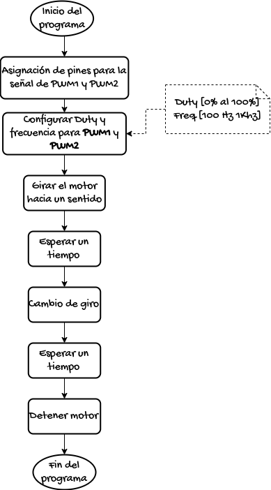
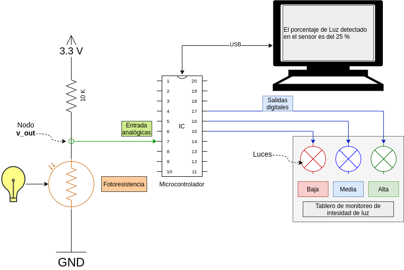

```{=html}
<!--
author:   Johnny Cubides
email:    jgcubidesc@unal.edu.co
version:  0.1.0
language: en
narrator: UK English Female
logo:     
comment:  Documentación para el curso de Taller de Ingeniería Electrónica de la Universidad Nacional de Colombia
script:   https://cdn.jsdelivr.net/chartist.js/latest/chartist.min.js
          https://felixhao28.github.io/JSCPP/dist/JSCPP.es5.min.js
link:     https://cdn.jsdelivr.net/chartist.js/latest/chartist.min.css
link:     https://cdnjs.cloudflare.com/ajax/libs/animate.css/4.1.1/animate.min.css
-->
```
# Taller de Ingeniería Electrónica

[Enlace liascript del curso](https://liascript.github.io/course/?https://raw.githubusercontent.com/johnnycubides/taller-ing-electronical-UNAL/main/README.md#1)

<h2>Proyecto</h2>

A continuación verá un esquema que representa las diferentes fases/tareas del desarrollo de un proyecto en el curso de taller de electrónica:


<h3>¿Qué queremos hacer?</h3>

En nuestro curso lo que deseamos hacer es un producto terminado,
que esté orientado a la solución de una situación real.

<h3>¿Qué se debe entregar?</h3>


* **Sistema electrónico**
* **Caja**
* **Documentación**
* **Brochure comercial**

<h3>Sobre el sistema electrónico</h3>

 

El dispositivo deberá responder a los requerimientos funcionales y no funcionales
y además tener las siguientes características:

* Desarrollar una PCB a la medida de la necesidad; podrá desarrollar el sistema embebido completo o desarrollar una tarjeta hija para una tarjeta de desarrollo.
* Para las tareas de software se puede hacer uso de *Micropython*.
* El sistema debe permitir la comunicación con otros dispositivos para monitoreo o control por parte del usuario final (puede ser a través de un medio guiado o no, lo cual depende de la aplicación).

<h3>Sobre la caja</h3>

 

En este caso se refiere a los aparatos encargados de realizar las tareas mecánicas, de protección,
estéticas, de experiencia de usuario, las cuales contienen sensores, actuadores y el sistema diseñado;
puede hacer uso de CAD para impresión 3D, corte láser, existen bibliotecas libres en Internet que
podrá descargar y ajustar a la necesidad.

<h3>Sobre la documentación</h3>

Queremos documentar el proceso de desarrollo, para tal fin puede hacer uso de:

* git
* Wiki

En primer lugar GIT es un sistema de gestión de versiones para proyectos de cualquier tipo que
permite seguirle la pista a nuestro proyectos de manera colaborativa; puede hacer uso de gestores
de repositorios de proyectos como *gitlab*, *codeberg*, *github*, *bitbucket* o cualquier otro que conozca.

Con respecto a la Wiki, en realidad puede ser en cualquier lugar siempre y cuando muestre el proceso
realizado del proyecto como también el producto terminado con algún demo; los gestores de repositorios
de proyectos anteriormente mencionados tienen la posibilidad de crear wikis asociadas al proyecto, pero
también puede hacer uso de un blog o crear páginas web staticas (gitlab y github tienen esa propiedad y por ahora es libre).

<h3>Sobre el brochure</h3>

Queremos que piensen que este producto va a ser ofrecido a un público que lo pueda necesitar por tanto
muestre el producto de tal manera que se pueda reconocer sus características y particularidades.

Ejemplo de brochure:


## Proceso de diseño


### Ideación

[Vídeo actividad 1](https://drive.google.com/file/d/1cr9HWrEm-xNYFIIi8ZitDjLSpGTT1DDn/view?usp=share_link)

### Diagrama de Cajas Negras


<div>

    <iframe width="560" height="315" src="https://www.youtube.com/embed/HvkKBwPVH_0" title="YouTube video player" frameborder="0" allow="accelerometer; autoplay; clipboard-write; encrypted-media; gyroscope; picture-in-picture; web-share" allowfullscreen>
    </iframe>

</div>

### Diagrama de flujo

### Poster

## Creación de PCB

### Tamaño de pistas para el ruteo de pistas

Para algunas tecnologías que encontrarán en Bogotá para creación de la PCB
se recomienda en KiCad hacer uso de los siguientes tamaños:


Las anteriores reglas definen dos tipos de clases, una que se llama POWER, para las pistas que
requieren conducir más energía y las SIGNAL, las cuales son solo señales de información. Si
requiere que por las pistas circule una mayor corriente, deberá diseñar pistas con un ancho mayor.

Estas reglas las puede editar en `File -> Board Setup -> Desing Rules -> Net Classes`

A continuación se puede ver un ejemplo donde se asocia las reglas de net a específicos patrones
de nets


### Conectores pinheader y pinsocket

Estos conectores se pueden usar para diferentes sensores y actuadores, como es el caso
de sensores ultrasonido o servomotores sg90. En kicad las huellas son conocidas
como pinheader de 2.54mm y pinsocket de 2.54mm


## Herramientas

### Tarjetas de desarrollo

-   [Raspberry Pi Pico](https://www.raspberrypi.com/products/raspberry-pi-pico/)
-   [Raspberry Pi Pico W](https://www.raspberrypi.com/products/raspberry-pi-pico/)
-   [NodeMCU esp8266](https://github.com/nodemcu/nodemcu-devkit)
-   [NodeMCU esp32 wroom]()
-   [Esp32CAM]()
-   [BluePill (stm32f103)]()
-   [Arduino UNO (atmega328p)]()
-   [Arduino Nano (atmega328p)]()
-   [Arduino Pro (atmega328p)]()

**Comparativa entre placas de desarrollo**

|Tarjeta de Desarrollo|Arquitectura|Lenguaje de prog|Perifericos|RAM @ ROM|N. pines io|Vin @ Vpin|
|:-------------------:|:----------:|:--------------:|:---------:|:-------:|:---------:|:--------:|
| NodeMCU esp32 Wroom | espressif xtensa, dos nucleos, 80 to 240 MHz, 32bits | Python, Lua, C, C++, Forth, Asm | uart, i2s, spi, adc, dac, wifi, bluetooth | 520 KB sram @ 448 KB rom y 4 MB flash | 25 Digitales de los cuales 15 Analógicos | 5V @ 3.3V |
| ESP32CAM Wroom | espressif xtensa, dos nucleos, 80 to 240 MHz, 32bits | Python, Lua, C, C++, Forth, Asm | uart, i2s, spi, adc, dac, wifi, bluetooth, camera | 520 KB sram y psram 4MB @ 448 KB rom y 4 MB flash | 10 Digitales de los cuales 7 Analógicos | 5V @ 3.3V |
| Nodemcu esp8266 e12 | espressif xtensa, 80MHz to 160 MHz, 32bits | Python, Lua, C, C++, Forth, Asm | uart, i2s, spi, adc, dac, wifi | 50 KB @ 4 MB flash | 10 Digitales y 1 ADC | 5V @ 3.3V |
| Raspberry Pi Pico | rp2040, dos nucleos, 133 MHz, 32bits | Python, Lua, C, C++, Forth, Asm | uart, i2s, spi, adc, dac | 264 KB sram @ 2MB flash | 23 Digitales y 3 Analógicos | 5V @ 3.3V |
| Raspberry Pi Pico W | rp2040, dos nucleos, 133 MHz, 32bits | Python, Lua, C, C++, Forth, Asm | uart, i2s, spi, adc, dac, wifi, bluetooth | 264 KB sram @ 2MB flash | 23 Digitales y 3 Analógicos | 5V @ 3.3V |
| Arduino UNO | Atmega328p, 16MHz, avr8, 8bits | C, C++, Forth, Asm | uart, i2s, spi, adc | 2 KB sram @ 32 KB flash | 20 Digitales y de ellos 6 Analógicos | 5V @ 5V o 3.3V |
| Arduino Nano | Atmega328p, 16MHz, avr8, 8bits | C, C++, Forth, Asm | uart, i2s, spi, adc | 2 KB sram @ 32 KB flash | 20 Digitales y de ellos 6 Analógicos | 5V @ 5V o 3.3V |
| Arduino Pro | Atmega328p, 16MHz, avr8, 8bits | C, C++, Forth, Asm | uart, i2s, spi, adc | 2 KB sram @ 32 KB flash | 20 Digitales y de ellos 6 Analógicos | 5V @ 5V o 3.3V |

#### Nodemcu ESP32 Wroom

**Esp32 dev kit**:


**Pinout esp32**:


**Herramientas para esp32:**

-   [Configuración de Thonny editor para micropython en placas de desarrollo esp8266 y esp32](https://randomnerdtutorials.com/getting-started-thonny-micropython-python-ide-esp32-esp8266/)

-   [Firmware micropython para esp32 (Download firmware.bin)](https://micropython.org/download/esp32/)

-   [Referencia rápida de micropython con el esp32](https://docs.micropython.org/en/latest/esp32/quickref.html)

#### ESP32CAM

**Esp32CAM:**


**¿Cómo conectar el esp32CAM?:**

El esp32CAM no cuenta con un adaptador USB a UART en la placa y este debe ser agregado, existen varios que pueden ser útiles como pueden ser:

-   FT232RL (recomendado)
-   CH340
-   CP2102

El siguiente gráfico muestra cómo debe quedar conectado el esp32CAM, el cable de color verde es agregado en el momento de subir el firmware y no es requerido cuando
el esp32cam está en modo de ejecución de programas.


**Pinout del esp32cam:**


**Herramientas de referecia**:

-   [Todo sobre el esp32cam](https://randomnerdtutorials.com/esp32-cam-video-streaming-face-recognition-arduino-ide/)
-   [Esp32cam con micropython](https://github.com/tsaarni/esp32-micropython-webcam)
-   [Esp32cam con micropython](https://github.com/lemariva/micropython-camera-driver)

#### Raspberry Pi Pico y Pico W

**Raspberry Pi Pico y Pico W:**


**Pinout raspberry pi pico:**


**Herramientas y documentación Raspberry pi pico:**

-   [Firware micropython: descarga e instalación](https://www.raspberrypi.com/documentation/microcontrollers/micropython.html#drag-and-drop-micropython)

-   [Documentación de micropython para raspberry pi pico](https://docs.micropython.org/en/latest/rp2/quickref.html)

-   [Hoja de datos (datasheet) para la raspberry pi pico](https://datasheets.raspberrypi.com/pico/pico-datasheet.pdf)

#### Arduino UNO

**Arduino UNO:**


**Pinout de Arduino UNO:**


**Herramientas para Arduino:**

-   [Arduino IDE (software)](https://www.arduino.cc/en/software)

### Entornos de programación

-   [Thonny Editor](https://thonny.org/)
-   [MIT App Inventors](https://appinventor.mit.edu/)
-   [Arduino IDE](https://www.arduino.cc/en/software)
-   [Espruino](https://www.espruino.com/)
-   [Node-RED](https://nodered.org/)

#### Thonny Editor


Tohnny Editor es un entorno de desarrollo en lenguanje [Python](https://docs.python.org/es/3/tutorial/) que puede servir para diferentes
placas de desarrollo con un intérprete de [Micropython](https://micropython.org/):

-   esp8266
-   esp32
-   Raspberry Pi Pico

En el siguiente enlace encontrá las instrucciones de instalación según sistema operativo y placa de
desarrollo:

[Cómo instalar Thonny Editor y configurar para una placa de desarrollo](https://randomnerdtutorials.com/getting-started-thonny-micropython-python-ide-esp32-esp8266/)

### Simuladores de circuitos

-   Qucs
-   LTSpice
-   CircuitJS

#### Qucs


**Instalación de Qucs en Windows y primer acercamiento**

<div>

    <iframe width="560" height="315" src="https://www.youtube.com/embed/624if7zhbIU" title="YouTube video player" frameborder="0" allow="accelerometer; autoplay; clipboard-write; encrypted-media; gyroscope; picture-in-picture; web-share" allowfullscreen>
    </iframe>

</div>

**Ejemplos de uso de Qucs en GitHub**

En el siguiente repositorio de github podrá encontrar Ejemplos
de uso para dominar este excelente simulador.


[Ejemplos de uso de Qucs en github](https://github.com/johnnycubides/qucs-tutorial-examples/tree/main/examples)

### Herramientas para diagramar

-   [Excalidraw](https://excalidraw.com/)
-   [Drawio](https://github.com/jgraph/drawio-desktop/releases)
-   [Pencil Project](https://pencil.evolus.vn/)

### Herramientas de documentación

-   GitHub
-   Codeberg
-   Bitbucket
-   Gitlab

Las anteriores herramientas hacen uso del formato de Markdown para realizar la documentación **Markdown**.

#### Markdown


[Tutorial Markdown](https://www.markdowntutorial.com/es/)

#### Git

**GITHUB DESKTOP**


La recomendación para iniciarse con la herramienta de Git y Github es hacer uso de *Github Desktop*,
se recomienda buscar vídeos sobre el uso de esta herramienta.

-   [Github client desktop](https://desktop.github.com/)

### Herramientas de diseño de PCB

#### KICAD


**DOCUMENTACIÓN DE KICAD**

[Enlace de documentación oficial de kicad](https://docs.kicad.org/)

[Enlace de descarga de Kicad para varias plataformas](https://www.kicad.org/download/)

> Si usa Linux puede abrir la terminal y ejecutar el siguiente comando para instalar Kicad:
> `sudo apt install kicad`

**MI PRIMER PCB CON KICAD**


[Make Your First Printed Circuit Board](https://www.build-electronic-circuits.com/kicad-tutorial/?fbclid=IwAR3OwgRqwc85H-j0YJTUkhBbJpkR1eex80cYIkS15KJx4cIzqhzl-UpF0DQ): Este tutorial en idioma inglés acerca al estudio de la herramienta de diseño *kicad* mientras crea su primera PCB.

**EJERCICIOS DE ROUTEO**


[flow free](https://www.bigduckgames.com/flowfree): Para desarrollar la habilidad de routeo, puede realizar hacer uso de la herramienta **flow free**
la cualnos reta a pensar la manera correcta de conectar nodos de colores a través de puentes, la herramienta está compilada en distintas tiendas.

## Talleres

### Iniciandome con las herramientas de desarrollo

Este taller pretende orientar al estudiante en el inicio *Maker*; en
este taller se enfretará a desarrollar cosas como:

-   Análisis de corriente de un circuito D.C.

#### Uso del multímetro

-   ¿Cómo verificar que los fusibles del multímetro no están dañados?
-   ¿Cómo medir el valor de una resistencia?
-   ¿Cómo calcular el valor de una resistencia de carbón?
-   Configuración de fuente DC y medición de tensión de la misma con el multímetro

**Referencias útiles**

-   [Calculadora de resistencias digikey](https://www.digikey.com/es/resources/conversion-calculators/conversion-calculator-resistor-color-code)
-   Ver el vídeo [Resistencias explicadas](https://www.youtube.com/watch?v=blUimcoNpKs&t)

#### Mi primer circuito

Puedes decargar el taller "Mi primer circuito" desde [aquí](./docs/taller1.md.pdf)

1.  MATERIALES A USAR

-   Una fuente de energía D.C. de tensión variable.
-   Un par de cables bananas caimán
-   Conectores rápidos (jumper dupon)
-   Protoboard
-   Una resistencia de cualquier valor no mayor a 33 Kohms.
-   Un LED de cualquier color.
-   Dos multímetros, uno para medir corriente y el otro tensión.
-   Cuaderno para realizar apuntes

2.  REALIZA ESTE PRIMER MONTAJE

A continuación podrás ver un diagrama pictográfico el cual es una aproximación
de como se ven las cosas realmente.


Una manera abstracta de entender como está interconectado un circuito es a través
de un esquemático, este diagrama muestra los componentes representados por símbolos
con sus nodos de conexión y además etiquetados como sigue:

> R1: Resistencia
> DC Power 1: Fuente de energía DC
> LED1: Diodo emisor de Luz


3.  ENERGIZAR CIRCUITO

-   Se debe verificar que el circuito realizado corresponda al propuesto en esta guía.
-   A continuación conecta la fuente de energía y empieza con un voltaje de 0 V.
-   Realizar incrementos de tensión de la fuente hasta que el LED se encienda y que la intensidad lumínica sea la deseada,
    es decir, ni tan tenue pero tampoco tan intensa.

**Observación**: En la electrónica existen componentes polarizados y no polarizados, un elemento no polarizado
es aquel que no requiere una orientación para su funcionamiento como sucede con la resistencia; en el caso
del LED este si tiene polaridad (Ánodo y Cátodo) y si no enciende es muy probable que deba intercambiar
sus pines de conexión para su funcionamiento correcto.

4.  MEDIR VOLTAJE EN CADA COMPONENTE DEL CIRCUITO

Como se mencionó con anterioridad, tenemos tres componentes R1, DC Power y LED1. Para
medir el voltaje deberás poner el multimetro en modo V en DC, como se ilustra en las
siguiente imagen, además de lo anterior, se pone las puntas del multimetro en los puertos
de conexión indicados como **COM** (cable negro) y **V**. Las puntas del multimetro deberán
ser conectada sobre cada componente en cada uno de sus nodos de conexión, en la imagen siguiente
se observa como se realiza la medición de la tensión (voltaje) en el *LED1*.


Observar el diagrama esquemático siguiente, en el se puede observar como se realiza la medición
de la tensión.


Comprendiendo como se realiza las mediciones de tensión en cada uno de los tres componentes,
registra los valores obtenidos en una tabla, como en el siguiente ejemplo:

|Componente|Tension V|
|:--------:|:-------:|
|R1|3.5 V|
|DC Power 1| 5 V|
|LED1|1.5 V|

5.  COMPROBAR LA SIGUIENTE TEORÍA

En un circuito existen componentes activos y pasivos; los activos son aquellos que son
capaces de entregar energía como es el caso de la *DC Power*, mientras que los pasivos
son aquellos que consumen energía como es el caso de *R1* y *LED* los cuales
manifiestan este consumo en Luz y calor.

Un circuito eléctrico cerrado como es el caso anterior donde solo hay un camino cerrado por donde pueda
transportarse electricidad conservará su energía; lo anterior se puede interpretar como sigue:
`la energía que se entrega al circuito es igual a la que se consume`.

Lo anterior en terminos de voltaje se puede representar así:

> $$ V_{DC\_POWER\_1} = V_{R1} + V_{LED1} $$

Hay que comprobar la anterior ecuación, tomando los valores obtenidos y registrados en la tabla comprueba
que la tensión en la fuente es igual a la suma de las tensiones de los componentes que consumen energía.

6.  MEDICIÓN DE CORRIENTE ELÉCTRICA

Para medir la corriente eléctrica que pasa por el circuito con el multimetro, éste último
deberá hacer parte de ese cicuiro cerrado, por tanto, deberá abrir un nodo en el circuito
y poner en serie el multimetro con los demás componentes; para mayor claridad observe las
siguiente imagen:


Observe ademés de los cables cómo están interconectados que la perilla o selector del multímetro se debe
poner en la función de medición de corriente continua simbolizado con la letra **A** la cual tiene encima
dos líneas: una línea recta y continua y debajo de ella una línea recta y discontinua.

También puede ver la abstracción de este diagrama pictográfico, donde preste atención a los nodos de conexión,
verá que solo hay un camino cerrado en el circuito.


**Observación**: Dependiendo del multímetro, se puede usar escalas diferentes a **A**, tal es el caso de **mA** (miliamperios) o **uA** (microamperios).

#### Simulación de circuitos


La simulación es una herramienta que permite comparar los resultados de los cálculos de los diseños eléctricos, antes de
realizar una implementación física del mismo, en las simulaciones se pueden observar comportamientos de diferentes variables,
como puede ser el caso de corriente eléctrica, voltaje, potencia, impedancias, frecuencia de operación, entre otros.

En el siguiente enlace podrá ver la simulación del circuito denominado "mi primer circuito"; podrá observar de manera gráfica
el voltaje (a modo de colores), la corriente que circula por los conductores (puntos amarillos que se desplazan por el circuito),
y la intensidad de encendido del LED rojo (Dependiendo de la potencia eléctrica que es consumida en el LED, el color rojo cambiará
su intensidad).

[Enlace para observar la simulación de mi primer circuito](https://www.falstad.com/circuit/circuitjs.html?ctz=CQAgjCAMB0l3BWcMBMcUHYMGZIA4UA2ATmIxAUgpABZsKBTAWjDACgA3cYlcDQ7rzAo8UMTSpIq06AjYAnECgkhiA3DVUCq2XGzCFe2BEJEhjQ-kpAATBgDMAhgFcANgBcmrhjfBiZkOwA7uYm4GYWWlBsIZFq5pCa8ZAxguGiYDxRKSGZvPHKVMmpeXwCpWiiOWmVoby11ZG1kWBWKQDmNfg1yv5sAPa0IISaVDSEYJJQ0BBUvJrYbEA)

EL siguiente archivo el cual es un texto plano (.txt) es la representación en [spice](https://es.wikipedia.org/wiki/SPICE), la cual indica por números de nodos
cómo está interconectado un circuito y qué modelo corresponde, se invita a descargar el archivo y leer su contenido para comprender cómo está codificado.

[Archivos en formato .txt de mi primer circuito en CircuitJS](./desing/t1-primer-circuito/simulacion-circuitjs/simulacion-mi-primer-circuito-circuitjs.txt)

Desde luego hay diferentes tipos de simuladores, están aquellos como éste ([circuitjs](https://www.falstad.com/circuit/circuitjs.html))que es a nivel pedagógico una herramienta poderosa para visualizar el comportamiento,
pero también hay otros simuladores con características profesionales que pueden ser opensource, gratis o privativos, a continuación se señalan dos de ellos que pueden ser útiles en su carrera de ingeniería.

-   [Qucs](https://ra3xdh.github.io/)
-   [LTSpice](https://www.analog.com/en/design-center/design-tools-and-calculators/ltspice-simulator.html)

**Observación** Sobre cómo instalar Qucs, puede seguir las instrucciones que encontrará en [este enlace](https://github.com/johnnycubides/qucs-tutorial-examples/)

#### Reto de diseño

En vista de lo aprendido en el taller "Mi primer circuito" deberá desarrollar el siguiente reto que verá en la siguiente imagen.


### Diferencia entre lo analógico y lo digital

Determinar el betra del transistor

Conocer el valor de corriente para el giro de motor.

Montar el siguiente circuito:


Cambiar la fuente DC por un generador de señales cuadrada equivalente y controlar el PWM

Agregar una tarjeta de desarrollo para programar el PWM.


### Driver de motor

Realizaremos el siguiente circuito el cual corresponde a un driver *Puente H* con tecnología de transistores
npn discretos (2n2222a)


Para reconocer el funcionamiento podrá ir al siguiente enlace y conocer las configuraciones posibles:

-   [Simulación en circuitjs del puente H](https://www.falstad.com/circuit/circuitjs.html?ctz=CQAgjCAMB0l3BWcMBMcUHYMGZIA4UA2ATmIxAUgoqoQFMBaMMAKDDwgRTxGzQuIpe-Ku2KQchKdAAsYTDIQyeMJEhgyoslgBcQMviBQyqMwpuNVRIBtliLsB4lxni8yldEJ4MYDIT4wCQRxf2QqABM6ADMAQwBXABsdXX1DE1NzfTgocBsUaCIMGQwyS0IEfwtobEJi0owUbGdIBEJMRmJwkCi4pJS9OqFLEHMqEesGBGhSWdnsPGI8bDBsGxgJA1KzWoMF-DWgyJiE5NSh7Koxy9yIGEIwB+U2wQ5FRa0SVu5IZsgiLiNbq9U4pADu+iyfFo3GEVhYELMFjakM00KgCNRvHcWPRkEx1wWmkJIkxISE6JJ8Ih1xQKKpGMRWTkhCxympoxM+kenNMeA5SKMxix8hUBK5ot5Qs0+LQ5EFktcrMVIAAbgBjdUsOVSyUXFUarUAczZ-LZxFZ8JN13ZUqVuXxACduayMrxvDdRPAWM6WUYubUeBNwk7Rngg1zJP6rCGfWGeG6o26vXBMX6RgZhlz8YieW7M56CUC3d4Ezkc6MgSNS9GMaqQK9eLUG7DuCpclzLQ7oAgWCbG9guC2eIGHZiB82B0PZRJh0YURbxijNIbx62F63wxidYOs1R0RmQAAjVg7odu9H54-YbWzjDnnIYHFXo8yW-ke97kBPixczRHlAWAAD30Yp-VZShWWMLpfxAABFVgQJCZEIHaKClH0f14MAkCzDLchKFMIJMOFOCbyQ0hsi6AIIDkIRYLgt8IV3WtRwmTEWIvD1k0xJNHwfDkoxGT9a3xAAlb8BMk+ishjAMagdLRewkliRhY3AZQ7fcFJjVQWBUqTONkrTFKsHt9Ok2sRI0xTs1M8ygA)

-   [Archivo en txt de la simulación del puente H en circuitjs](./desing/t3-bridge-h/circuit-20231004-0511.circuitjs.txt)

> **Programa a realizar**: Realice el programa que está planteado en el siguiente diagrama de flujo; haga uso del esp32 o rp2040
> y Micropython.



> **Reto**: Realice un programa con funciones de python las cuales puedan ser llamadas desde el prompt de micropython
> para iniciar o detener el motor.

Recuerde también que puede hacer uso del programa de encendido de LEDs para adaptarlo para este taller:

``` py
# Importar la librería para el manejo de pines
from machine import Pin
#librería para control por ancho de pulso
from machine import PWM

# Se configura el pin D22 como un PWM
led22 = PWM(Pin(22), freq=30, duty=0)
led23 = PWM(Pin(23), freq=30, duty=512)


# Si desea cambiar frecuencia
led22.freq(5)
led23.freq(15)


# Si desea cambiar el ancho del pulso
# 0 para 0% y 1023 para 100%, 50% es 512
led22.duty(512)
led23.duty(100)


# Para detener
# led.deinit()
# Para reiniciar
# led.init()
```

### Periferico ADC

El conversor ADC es un módulo que convierte señales de tensión
analógicas a valores enteros en un rango determinado; la resolución
de la conversión está determinada por el tamaño de bits del conversor,
es decir, si el ADC es de 16 bits, el número máximo a obtener en una
conversión será de $2n^{16}-1=65535$.

**ESQUEMÁTICO**:
Este diagrama representa la solución a realizar, solo se ha agregado en sí el
circuito para el sensor de Luz que es alimentado por la tensión ofrecida desde
el pin de 3.3v (3v3 o 3V) de la tarjeta de desarrollo, para crear los demás
elementos del circuito deberá remitirse a los conocimientos previos de los anteriores
talleres.



**PROGRAMA A REALIZAR**:

Traduzca este algoritmo a una tecnología/lenguaje, en este caso a micropython,
si tiene dificultades para crear las diferentes instrucciones, remítase a algún
tutorial del lenguaje python3.


**RECOMENDACIÓN PARA LA REALIZACIÓN DEL PROGRAMA**:

Para que pueda resolver este problema podrá seguir estas recomendaciones:

1.  Realice el circuito planteado e identifique el nodo de voltaje *v_out*
2.  Como es un sensor de Luz deberá provocar los dos casos extremos: cuando hay mucha luz 100 %
    o poca luz 0 %; para provocar estas dos situaciones use sus manos para tapar el sensor y que no reciba luz
    0% y por medio de la linterna del celular estimule el sensor para obtener el 100 % de la intensidad de la luz.
3.  Simultáneamente al paso 2 mida el voltaje con un multímetro entre el nodo *v_out* y *GND* observe el cambio
    de voltaje que existe en proporción de la intensidad de luz percibida por el sensor e indique qué tipo
    de comportamiento tiene el voltaje en función de la luz recibida.
4.  Teniendo presente que el ADC convierte señales de voltaje a valores de unidades enteras haga un pequeño
    programa que imprima el valor del voltaje convertido en esas unidades (ver abajo ejemplos de código según tarjeta de desarrollo),
    para ello acompañe su código de la función `print()` en un `while True` acompañado con un
    `time.sleep(segundos)` y mire la relación que existe entre el voltaje medido con el multímetro
    y las unidades imprimidas en consola; determine la relación existente de las unidades en función
    del voltaje convertido por el ADC.
5.  Teniendo en cuenta los dos casos extremos realizados desde el paso 2, tome el valor de unidades obtenido
    para ambos casos (0% de luz y 100 % de luz), recuerde que estos valores se observan en la terminal y deben corresponder
    a la acción de aplicar los dos casos extremos del paso 2.
6.  Al tener los dos casos extremos que puede llamar $P_1$ y $P_2$ donde cualquier punto es una coordenada
    de la forma $P(unidades\_adc, porcentaje\_luz)$ y que en un plano cartesiano $P(x, y)$, $x=unidades\_luz$
    y $y=porcentaje\_luz$ trace una recta que una a esos dos puntos y construya una ecuación de la recta.
    Recuerde que la ecuación de la recta es de la forma $y(x) = mx + b$, la pendiente $m = {{y_2 - y_1} \over {x_2-x_1}}$ y
    que el punto de corte $b = y_1 -mx_1 = y_2 - mx_2$
7.  Con la información obtenida en el paso 6 construya una función en python que haga esa transformación, pruebe su funcionamiento
    estimulando el sensor como fue planteado en el paso 2 y si es coherente el resultado,
    construya el algoritmo planteado en este taller (PROGRAMA A REALIZAR)

``` py
# Fije el valor de la pendiente m
# m = ...
# Fije el valor de B
# b = ...
# Los anteriores valores los puede sustituir directamente en la ecuación.

def calcularPorcentajeDeLuz(val_adc):
    return m*val_adc + b
```

**USO DE ADC EN MICROPYTHON**

Para decidir cuál pin va usar para la conexión deberá tener presente el *pinout* de la tarjeta
de desarrollo en cuestión, revise que el pin a seleccionar debe permitir la configuración de
un periférico ADC.

-   [ADC ESP32](https://docs.micropython.org/en/latest/esp32/quickref.html#adc-analog-to-digital-conversion)

``` py
# On the ESP32, ADC functionality is available on pins 32-39
# (ADC block 1) and pins 0, 2, 4, 12-15 and 25-27 (ADC block 2).

from machine import Pin
from machine import ADC

pin = Pin(pin_number, Pin.IN)
adc = ADC(pin)        # create an ADC object acting on a pin
val = adc.read_u16()  # read a raw analog value in the range 0-65535
```

-   [ADC Raspberry Pico](https://docs.micropython.org/en/latest/rp2/quickref.html#adc-analog-to-digital-conversion)

``` py
# RP2040 has five ADC channels in total, four of which are 12-bit
# SAR based ADCs: GP26, GP27, GP28 and GP29. The input signal for
# ADC0, ADC1, ADC2 and ADC3 can be connected with GP26, GP27, GP28,
# GP29 respectively (On Pico board, GP29 is connected to VSYS).
# The standard ADC range is 0-3.3V. The fifth channel is connected
# to the in-built temperature sensor and can be used for measuring
# the temperature.

from machine import ADC, Pin
adc = ADC(Pin(pin_number))     # create ADC object on ADC pin
val = adc.read_u16()         # read value, 0-65535 across voltage range 0.0v - 3.3v
```

### Microcontrolador enviando datos a red local

En este taller se aprenderá a compartir los datos de los sensores en una red Local
como también dar órdenes a microcontroladores para que cambien el estado de algunos
actuadores. En este ejemplo, los sensores son simulados por funciones de generación
de datos aleatorios, por tanto, se invita a los estudiantes que después de comprender
el funcionamiento de este ejemplo modifiquen el ejercicio agregando sensores y actuadores
que han manejado en el transcurso del curso.


#### Configuración de Node-red

*Node-Red* es un software que permite conectar información de diferentes medios y protocolos
ya sea para almacenar, presentar o controlar información de interés en un sistemas.

**Instalación de node-red**

Para instalar Node-Red deberá primero instalar [NodeJS](https://nodejs.org/en) para su sistema operativo, seguido,
desde la línea de comandos de una terminal deberá instalar *node-red* con el gestor de paquetes
de *nodejs* denominado **npm**. Según su sistema operativo siga las indicaciones planteadas
en la documentación oficial:

-   [Instalar Nodejs](https://nodejs.org/en/download)
-   [Instalar Node-Red](https://nodered.org/docs/getting-started/windows)

Si tiene dificultades en la instalación puede buscar un ejemplo de instalación en Internet, Teniendo
presente la documentación oficial ya que puede tener algunas variaciones en los comandos que deberá
considerar, [ejemplo de instalación de node-red](http://pdacontroles.com/instalacion-node-red-en-windows/)

**EJECUTAR NODE-RED**

Para ejecutar la aplicación nuevamente desde la terminal ejecute el siguiente comando:

``` bash
node-red
```

Esto iniciará la aplicación y le pedirá que en el navegador que usted use escriba la dirección IP del
servicio para que pueda ser consumido, ejemplo:

``` bash
http://127.0.0.1:1880
```

Ponga la anterior dirección IP en el navegador para que *Node-red* esté listo para usarse.

**INSTALACIÓN DE COMPLEMENTOS/MÓDULOS EN NODE-RED**

Para que el ejemplo pueda ser ejecutado requiere los módulos de *Dashboard* y *Serialport*. Dashboard
permite crear una interfaz de usuario y Serialport la comunicación con el microcontrolador.

En la aplicación en la siguiente ruta busque e instale los módulos requeridos:

Ruta para instalación en la aplicación:`Menu -> Manage Palette -> Install -> Option and Search`

Módulos a buscar e instalar:

-   node-red-dashboard
-   node-red-node-serialport

Es posible que la aplicación le pida que deba reiniciar node-red, para tal fin, en la terminal, detenga
la ejecución con **Control + C** y vuelva a iniciar el servicio de node-red con **node-red** en la misma
terminal.

#### Flujo de Node-red

A continuación se comparte el flujo diseñado en node-red que podrá descargar e importar en node-red
y desplegar:

-   [node-red-flow.json](./desing/t5-node-red/node-red-flow.json)

El flujo importado y desplegado en node red permite la comunicación bidireccional con el microcontrolador
a través del puerto serial.


En la anterior imagen se puede observar los siguientes nodos:

-   Comunicación serial bidireccional (serialport RX y serialport TX)
-   Funciones para validar y dar formato a los mensajes que se envían y reciben (addCarrierReturn y checDataFormat)
-   Flujos de debug permiten darle seguimiento a los datos enviados o recibidos
-   Nodos de dashboard los cuales se despliegan y son visualizados por el usuario en un formato legible, con estos
    nodos el usuario monitorea y controla el sistema (LED ON y LED OFF como entradas de información, y Estado de los
    datos, Volt1 y Volt2 como salida de información visual).

La lógica de los nodos desplegados está escrita en javascript, para conocer cómo funciona puede dar clip en el nodos
y se mostrará una ventana con un menú e información de ello, ejemplo:


Para obtener la URL del dashboard desplegado puede dar clic en el ícono que encuentra en el menú del dashboard, ejemplo:


La anterior URL la puede compartir a otros dispositivos que estén en la misma red cambiando la ip de la URL por la IP
del equipo donde está el servicio de *Node-red* que en este caso es el computador, ejemplo:

Si la URL generada es:

``` bash
http://127.0.0.1:1880/ui/#!/0?socketid=2xbT63rXMJDBZ5i3AAAB
```

Y la ip del equipo es por ejemplo: `192.168.1.100` quedaría algo como lo siguiente:

``` bash
http://192.168.1.100:1880/ui/#!/0?socketid=2xbT63rXMJDBZ5i3AAAB
```

Se recomienda codificar la URL en un código QR para que pueda ser compartido a un celular.

#### Micropython y node-red (comunicación)

El siguiente programa que se ejecuta en el microcontrolador, permite la generación de los datos que
se van a compartir en la red, como se hace uso de micropython es importante reconocer que la programación
del microcontrolador se hace a través del REPL y ésta está compartida por el canal USB que será usado
para el envío de datos, por tanto, aunque funciona se puede optimizar para otros propósitos.

Observe en el código que se comparte que los datos son enviados a través de la función `print()`,
también observe que en este programa se hace uso de `threads` los cuales permiten la ejecución
de tareas en loops distintos de manera "simultanea".

``` py
import random, time, machine
from machine import Pin

led = Pin(25, Pin.OUT)

# Ésta función emula la lectura de un sensor
def readSensor():
    return random.random()*3.3

# variables globales
volt1 = 0
volt2 = 0

# Esta es una función que será usada para ejecutarse
# en un hilo independiente, puede crear otras
# funciones para otros propósitos si así lo desea
def thread_main():
    while True:
        time.sleep(2)
        volt1 = readSensor()
        volt2 = readSensor()
        print(volt1, volt2)

import _thread
# Inicio de un hilo de ejecución llamando a la función
# thread_main anteriormente creada
_thread.start_new_thread(thread_main, ())

# Función creada para recibir órdenes desde la
# comunicación serial, puede agregar las funciones que
# se desee realizar
def c(orden):
    if(orden == 1):
        led.on()
    elif(orden == 2):
        led.off()
```

Para el ejemplo, descargue el programa [main.py](./desing/t5-node-red/main.py) y guárdelo con ese nombre
en el microcontrolador que tiene micropython, libere el puerto de comunicación serial, en el caso de *Thonny*
cambie de interprete o cierre la aplicación, si es necesario desconecte y conecte el microcontrolador del
puerto USB.

Finalmente en Node-red reinicie los flujos y observe en el dashboard si se reciben datos desde el microcontrolador,
interactúe con los botones de encendido y de apagado del LED.


Si por alguna razón no se puede visualizar los datos, es recomendable reiniciar *Node-red* y refrescar las ventanas del
navegador.

## Tareas recomendadas

-   Ver el vídeo [Resistencias explicadas](https://www.youtube.com/watch?v=blUimcoNpKs&t), realizar la documentación (resumen, grafo, entre otros), compartir el resumen en discord.
-   Ver el víde [Cómo medir componentes electricos en PCB](https://youtu.be/h32zF39gwwY?si=oVr16mUTg775PU54), realizar la documentación (resumen, grafo, entre otros), compartir el resumen en discord.
-   Ver el vídeo sobre controladores industriales [Conceptos Básicos del Controlador de Lógica Programable](https://youtu.be/NPsepHRSCls?si=S1oRka1yMF5kJhVp).
-   Cómo soldar [Soldar para principiantes](https://youtu.be/NC2Vkf4pBKk?si=5r6KCW57Hb09AWDm)

## Vídeos recomendados en clase

-   [Simbiosos entre el arte, la ciencia y la tecnologia](https://www.youtube.com/watch?v=AB9VToh2y-s)
-   [Por esto no podemos tener cosas bonitas (obsolescencia)](https://youtu.be/m8KqmgSPAtg?si=kqyl1KUPXwsxRof2)
-   [África: El vertedero electrónico](https://youtu.be/zfDWE0TyS-w?si=99KWKwdTMwPvmHpL)
-   [Tecnología criolla](https://youtu.be/fh5WTvsvSwg?si=UOBS7h-vBRLTMpoZ)
-   [Arduino el documental](https://youtu.be/mltWc9_C9gs?si=kiv2YYFiv9YqnJFI)
-   [Construimos un smartwatch](https://youtu.be/GC0GuNWkyHg?si=jfrezkIOTFkaNdBO)

## Tiendas electrónicas

A continuación se comparte una lista de tiendas electrónicas que se
encuentran en bogotá y sus alrededores.

https://www.sigmaelectronica.net/

https://www.mactronica.com.co/

https://yorobotics.co/

https://electronilab.co/

https://www.vistronica.com/

https://www.controldinamico.com/

https://ferretronica.com/

https://laredelectronica.com/

https://www.bigtronica.com/

https://www.embtronik.com/

https://www.tuvoltio.com/

https://osakaelectronicsltda.com/

http://www.microelectronicos.com/

https://tundamacomplejoelectronico.com/locales/

https://ja-bots.com/

## Proyectos

**Plataformas de Crowdfunding**

Las plataformas de crowdfunding permiten visibilizar e impulsar proyectos
de emprendimiento artísticos, de desarrollo, de innovación entre otros.
Allí se han apoyado ideas de desarrollo interesante como han sido:

[Omega2](https://www.kickstarter.com/projects/onion/omega2-5-iot-computer-with-wi-fi-powered-by-linux?lang=es): Sistema embebido que costaba 5 dólares con capacidad de correr Linux y conexión WiFi.

[Mycropython](https://www.kickstarter.com/projects/214379695/micro-python-python-for-microcontrollers): Proyecto que permite programar microcontroladores en el lenguaje Python.

[Cubetto](https://www.kickstarter.com/projects/primotoys/cubetto-hands-on-coding-for-girls-and-boys-aged-3?ref=discovery_category_most_backed): Plataforma de programación de hardware tangible.

[Espruino](https://www.kickstarter.com/projects/gfw/espruino-javascript-for-things?ref=discovery_category_most_backed): Programa microcontroladores con el lenguaje de programación JavaScript.

[Papilio Duo](https://www.kickstarter.com/projects/13588168/papilio-duo-drag-and-drop-fpga-circuit-lab-for-mak?ref=discovery_category_most_backed): Crear circuitos y probar en FPGA de manera gráfica o por bloques.

[Endless](https://www.kickstarter.com/projects/1381437927/endless-computers?ref=discovery_category_most_backed): Computadoras para todo el mundo.

Si es necesario un poco de inspiración para emprender un proyecto, puede revisar
los siguientes sitios de crowdfunding, podrá encontrar proyectos que inclusive
podrá adoptar para emprender su propio proyecto.

**Enlaces a plataformas de crowdfunding**

[Kickstarter](https://www.kickstarter.com)

[Crowsupply](https://www.crowdsupply.com/)

[Indiegogo](https://www.indiegogo.com/)

[Ulule](https://es.ulule.com/)

**Plataformas de Chacharreo/Hackeo**

[Hackster](https://www.hackster.io)

[Hackaday](https://hackaday.com)

### Proyectos de Taller de Electrónica 2023-I

> [**Kaku Robot**, github](https://github.com/DonJoseGo/Kaku_Bot):
> Carrito con diferentes rostros cambiables realizado con madera capaz de sortear obstaculos y deplazarse en superficies planas. Cuenta con un ultrasonido que detecta estructuras cercanas y según la desicion del usuario el robot puede realizar una acción como prender una luz led del color que escoja. Finalmente su brazo con movimiento oscilatorio puede ser usado para mover objetos pequeños.


!?[Video](https://user-images.githubusercontent.com/133617253/249571967-81911118-b9c0-4a47-818a-cdb0a08687de.mp4)

> [**Michi bot**](https://github.com/Extra72004/MichiiBot/tree/main)

!?[Michi bot](https://raw.githubusercontent.com/Extra72004/MichiiBot/main/Evidencias%20Montaje/Video%20de%20funcionamiento.mp4)


