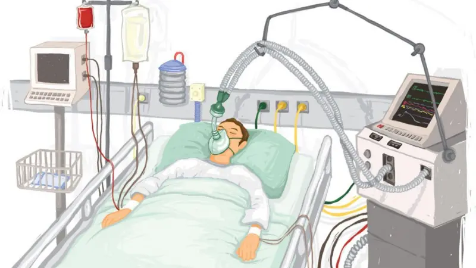

# Flujo de diseño

Presentado por **Johnny Cubides**

----

## Descripción

Se presenta el flujo de diseño para la creación de prototipos
con herramientas opensource tanto de hardware como
de software.

-----

<!-- .element: style="height: auto; width: 60%; display: block; margin: auto;" -->

----

# Fases del flujo de diseño

----

## Requerimientos funcionales y no funcionales

Objetivos a alcanzar en función de la situación abordada en contexto.
- Producto mínimo viable
- The business model canvas

-----

### Situación problema

 

-----

### Situación problema

Durante la pandemia de COVID-19 en 2019, la creciente demanda de respiradores en las unidades de cuidados intensivos expuso una crítica falta de disponibilidad de estos equipos esenciales en los hospitales. El aumento exponencial de pacientes con complicaciones respiratorias severas sobrepasó rápidamente la capacidad instalada, generando una crisis en la atención médica. Esta escasez no solo limitó la capacidad de los hospitales para tratar a los pacientes más graves, sino que también obligó al personal médico a tomar decisiones éticamente complejas sobre la asignación de recursos, impactando tanto la calidad del cuidado como las tasas de supervivencia.
<!--.element: style="font-size: 80%;"-->

-----

### Prototipo

Para hacer frente a la escasez de respiradores, se creará un dispositivo utilizando herramientas de prototipado rápido como cortadoras láser, impresoras 3D y plataformas como Arduino. Este respirador será diseñado para ser de bajo costo y fácil de producir rápidamente, adaptándose a las necesidades de los hospitales. La fabricación de piezas precisas se realizará mediante cortadoras láser, mientras que las impresoras 3D se utilizarán para crear componentes personalizados. El control de los sistemas electrónicos será gestionado a través de Arduino, permitiendo la creación de una alternativa viable para incrementar la disponibilidad de respiradores en momentos de alta demanda.

<!--.element: style="font-size: 80%;"-->

-----

### Prototipo

 

-----

### Requerimientos Funcionales

1. Monitoreo de presión y flujo de aire: El respirador debe ser capaz de medir y controlar la presión y el flujo de aire para asegurar que se administren niveles adecuados de oxígeno al paciente, adaptándose a sus necesidades respiratorias.
2. Control de parámetros ajustables: Debe permitir la configuración de parámetros clave como la frecuencia respiratoria, volumen tidal y la relación inspiración/espiración, asegurando la personalización según las condiciones del paciente.
3. Alarma de seguridad: El respirador debe contar con un sistema de alarmas que avise al personal médico en caso de mal funcionamiento, como fallos en la presión o flujo de aire, o si los parámetros caen fuera de los rangos seguros.

<!--.element: style="font-size: 80%;"-->

-----

### Requerimientos no Funcionales

1. Seguridad: El respirador debe contar con sistemas de monitoreo y alarmas que garanticen su funcionamiento dentro de los parámetros seguros, alertando al personal médico ante cualquier irregularidad que pueda comprometer la salud del paciente.
2. Fiabilidad: El respirador debe ser altamente confiable, con un diseño robusto que minimice los riesgos de fallos mecánicos o electrónicos durante su uso prolongado, asegurando su correcto funcionamiento en todo momento.
3. Durabilidad: El respirador debe estar fabricado con materiales resistentes que aseguren su funcionamiento a largo plazo, incluso en condiciones de uso intenso, manteniendo su eficiencia y resistencia ante el desgaste.

<!--.element: style="font-size: 80%;"-->

-----

### Evaluación de requerimientos

El desarrollo de respiradores mediante tecnologías de prototipado rápido, como impresoras 3D, cortadoras láser y plataformas como Arduino, enfrenta importantes dificultades para cumplir con los estrictos estándares y normas médicas internacionales que aseguran la seguridad y eficacia de los dispositivos médicos. Normas como las de la FDA o ISO 13485 exigen rigurosos procesos de certificación, pruebas exhaustivas de calidad y controles estrictos sobre los materiales y la fabricación, aspectos que son difíciles de alcanzar en estos prototipos. La falta de experiencia en producción a gran escala, el control de calidad continuo y la trazabilidad de los componentes hacen que estos dispositivos no cumplan con los requisitos exigidos para garantizar su fiabilidad y seguridad en un entorno clínico profesional.
<!--.element: style="font-size: 80%;"-->

-----

### Canvas

<!-- .element: style="height: auto; width: 100%; display: block; margin: auto;" -->

